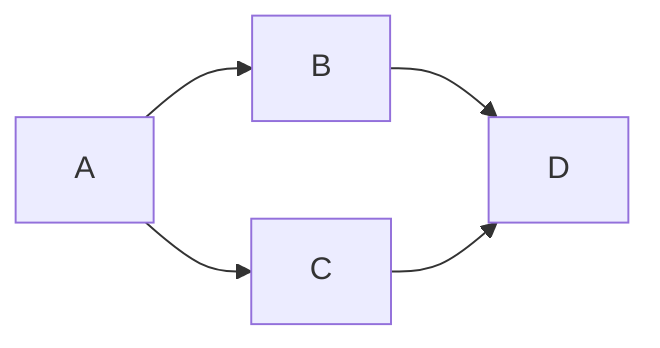

<script type="text/javascript" src="https://cdnjs.cloudflare.com/ajax/libs/mathjax/2.7.0/MathJax.js?config=TeX-AMS_CHTML"></script>

<style type="text/css">
.mermaid svg {  
}
</style>

## 1. feladat - Csicsó, Farkas, Fekete, Holló

Egy $3\times 3$-as "sakktáblán" egy huszár bolyong (lóugrásban tud lépni, és véletlenszerűen választ a lehetséges lépései közül). Jelölje $X_n$ a huszár helyzetét $n$ lépés után.
<ol type="a">
  <li>Van-e a láncnak stacionárius eloszlása, és ha igen, hány? Keressük meg! </li>
  <li>Várhatóan hány lépés alatt tér vissza a kiindulási helyére, ha a bal felső sarokból indul?</li>
  <li>Létezik-e határeloszlás, és ha igen, függ-e a kezdeti eloszlástól?</li>
</ol>

<div style="border:1px solid red;">

</div>

```
<dl>
  <dt>Definition list</dt>
  <dd>Is something people use sometimes.</dd>

  <dt>Markdown in HTML</dt>
  <dd>Does *not* work **very** well. Use HTML <em>tags</em>.</dd>
</dl>
```


### Gráf




### Stacionárius eloszlás

A lánc irrecubilis, pozitív rekurrens, ezért egyértelműen létezik stacionárius eloszlása. A gráf véges, egyszerű, összefüggő, és mivel az átmenetvalószínűségek azonosak, tekinthető irányítatlannak.

Ekkor a 2. feladat alapján: $\mu_i = \frac{d_i}{D}$. A gráf $2$-reguláris, vagyis $\forall d_i = 2$, ezért 
$$D = \sum\limits_{n=1}^8 d_i = 8\cdot 2 = 16. $$ Vagyis $\forall \mu_i = \frac{2}{16} = \frac{1}{8}$. A stacionárius eloszlás 
$$\mu = \left(\dfrac{1}{8}, \dfrac{1}{8}, \dfrac{1}{8}, \dfrac{1}{8}, \dfrac{1}{8}, \dfrac{1}{8}, \dfrac{1}{8}, \dfrac{1}{8}\right).$$

### Átlagos visszatérési idő

Tétel volt előadáson, hogy ha a lánc irreducibilis, pozitív rekurrens, akkor 
$$\mu_i = \pi_i = \frac{1}{m_i} \hspace{1cm} \Rightarrow  \hspace{1cm}  m_1 = \dfrac{1}{\mu_1} = \dfrac{1}{\frac{1}{8}} = 8.$$ Várhatóan 8 lépés alatt fog visszatérni a kiindulási helyre, ha a bal felső sarokból indul.

### Határeloszlás

Kérdés: $\lim\limits_{n\to \infty} p_i^{(n)}$ létezik-e, és függ-e a kezdeti eloszlástól?

Mivel a lánc pozitív rekurrens, de nem aperiodikus, ezért nem létezik határeloszlás.

**Precízebben**:

Tekintsük a $p_i^{(n)}$ sorozat $p_i^{(2n)}$ és $p_i^{(2n+1)}$ részsorozatát. Bármely $i$ esetén minden $n$-re $p_i^{(2n)}=0$ vagy $p_i^{(2n+1)}=0$ teljesül.^[Hiszen bárhonnan is indult a lánc, minden $i$ állapotba vagy csak páros, vagy csak páratlan sok lépés után kerülhet.]

Vagyis a $p_i^{(n)}$ sorozatnak van olyan részsorozata, ami konstans $0$, annak persze határértéke is $0$. Ha tehát $\exists \lim\limits_{n\to \infty} p_i^{(n)} = q_i$, akkor $q_i = 0$ teljesül $\forall i$-re. Ezért ha létezik határeloszlás, akkor az csakis a $q=(0,0,0,0,0,0,0,0)$ lehet. Ez viszont nem eloszlás, tehát azt kaptuk, hogy nem létezik határeloszlás.
<!--stackedit_data:
eyJoaXN0b3J5IjpbMTgyNzI4NjU1MiwtMTM3NTc1NjYxLC0yMT
QzNzY3NjQ4LDE1MjU3ODgzMDYsNzIwODU0ODEyLDUzOTk4MzEz
OCw0OTI0NjA1OTEsNjY2ODg0MTI1LDIwMDgyNjAwODEsNzE2NT
A4MzMzLC0yMzE1NjEwODMsLTc0OTQxNDYyOCwtMTMwNDYwMjQ3
NiwyNzUwODc0NjMsLTcxOTgxMTcwOSw5MTExODUwNzUsLTE4Mj
UyMjQwNzIsMzYwMjA5NDQ3LDczMDk5ODExNl19
-->